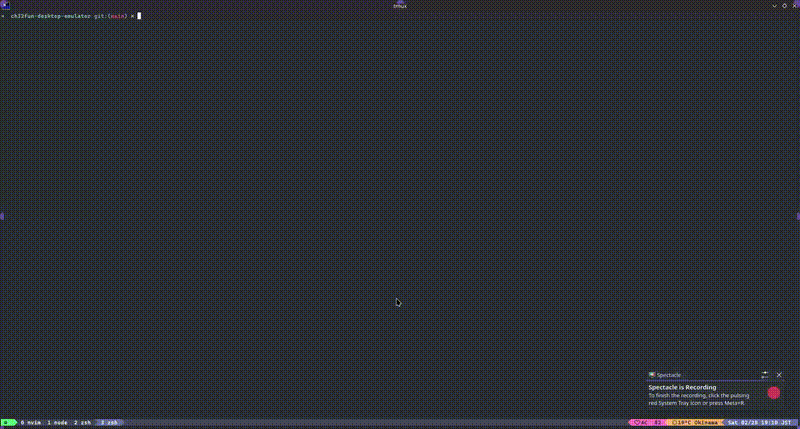

# CH32fun Desktop Emulator

[English README](../README.md)

CH32fun ベースのファームウェア ELF を端末上で実行するエミュレータです。SSD1306 風 OLEDをKitty Graphics ProtocolまたはSixelで128x64のまま表示します。

## デモ



## 機能

- 実行時にファームウェア `.elf` を読み込み
- CPU、flash、RAM、I2C 通信、ボタン入力、OLED VRAM をエミュレーション
- QingKe CPUを48 MHz、I2C1を設定値の1 MHzに同期して実行
- OLED フレームバッファをKittyまたはSixel対応端末へ高解像度表示
- 白色ピクセルを最近傍拡大し、上側・左側に余白を付けて鮮明に表示
- Kitty描画をzlib圧縮し、VRAM変更時だけ送信して端末負荷を抑制
- デバッグ向けの headless 実行をサポート
- Zig標準ライブラリのみを使用

## 必要環境

- Zig 0.16
- Kitty GraphicsまたはSixel対応端末

## ビルド

```sh
zig build
```

生成物:

- `zig-out/bin/ch32fun-desktop-emulator`

## `chemu`コマンドのインストール

```sh
scripts/install.sh
```

既定では`chemu`とReleaseFastで最適化したエミュレーター本体を`~/.local/bin`へインストールします。別の場所へ配置する場合は`PREFIX`または`BINDIR`を指定できます。

`ch32fun_zig`ベースのプロジェクト直下で次を実行します。

```sh
chemu
```

`zig build`を実行し、`zig-out/bin`内のRISC-V ELFを検出して、既定でKitty Graphics・60 FPSのエミュレーターを起動します。

- `--no-build`: 再ビルドせず既存の成果物を実行
- `--firmware PATH`: 複数のELFがある場合に明示選択

ランチャーオプションの後ろにはエミュレーターのオプションを指定できます。

```sh
chemu --graphics sixel --target-fps 30
```

## 使い方

ファームウェア ELF を指定して起動します。

```sh
zig build run -- --elf /path/to/firmware.elf
```

主なオプション:

- `--stats`: 1 秒ごとに実描画FPS、命令数、端末転送量などを表示
- `--cpu-slice N`: 1 スライスあたりの CPU 実行ステップ数
- `--target-fps N`: UI 表示更新の目標 FPS
- `--graphics auto|kitty|sixel`: 端末画像プロトコルを選択
- `--headless`: 端末画像を表示せずに実行
- `--steps N`: headless 実行時の命令実行数
- `--dump-oled`: headless 実行後に OLED 内容を ASCII で出力

例:

```sh
zig build run -- --elf /path/to/firmware.elf --stats
```

通常は既定値のままが最も効率的です。`--cpu-slice`を小さくすると入力遅延を短縮できますが、sleepと時刻取得の回数が増えてCPU負荷が高くなります。

headless 実行例:

```sh
zig build run -- --elf /path/to/firmware.elf --headless --steps 200000 --dump-oled
```

## 操作

- `Space`: タクトスイッチを押下・解放（Kitty keyboard対応端末では実際のkey-up、それ以外では150 msの短押し）
- `d`: タクトスイッチを押した状態にする
- `u`: タクトスイッチを解放する
- `Esc`、`q`、`Ctrl-C`: 終了

Kitty環境は`KITTY_WINDOW_ID`または`TERM`から自動検出し、それ以外ではSixelを選びます。必要なら明示指定できます。

```sh
zig build run -- --elf firmware.elf --graphics kitty --target-fps 60
zig build run -- --elf firmware.elf --graphics sixel --target-fps 30
```

## 補助スクリプト

[`tools/run-mopeck.sh`](../tools/run-mopeck.sh) は、関連する Mopeck ファームウェアプロジェクトをビルドしてから、このエミュレータを起動します。

```sh
tools/run-mopeck.sh
```

必要に応じて以下の環境変数を使えます。

- `MOPECK_DIR`
- `EMULATOR_DIR`

## ディレクトリ構成

- `src/`: エミュレータ本体
- `tools/`: 補助スクリプト

## ライセンス

GitHub で公開する前に、再利用を許可するならライセンスファイルを追加してください。
